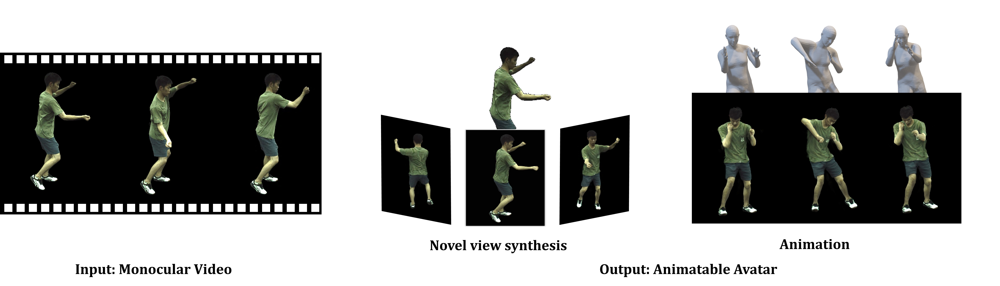
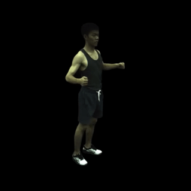
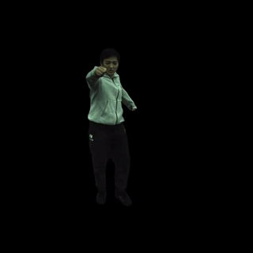

# MonoHuman: Animatable Human Neural Field from Monocular Video (CVPR 2023)




**MonoHuman: Animatable Human Neural Field from Monocular Video**<br>
[Zhengming Yu](https://yzmblog.github.io/),
[Wei Cheng](#),
[Xian Liu](https://alvinliu0.github.io/),
[Wayne Wu](https://wywu.github.io/),
and [Kwan-Yee Lin](https://kwanyeelin.github.io/)
<br>
**[Demo Video](https://www.youtube.com/watch?v=T91fXw9dOmM)** | **[Project Page](https://yzmblog.github.io/projects/MonoHuman)**
| **[Paper (coming soon)](#)**

This is an official implementation of MonoHuman using [PyTorch](https://pytorch.org/)

>Animating virtual avatars with free-view control is crucial for various applications like virtual reality and digital entertainment. Previous studies attempt to utilize the representation power of neural radiance field (NeRF) to reconstruct the human body from monocular videos. Recent works propose to graft a deformation network into the NeRF to further model the dynamics of the human neural field for animating vivid human motions. However, such pipelines either rely on pose-dependent representations or fall short of motion coherency due to frame-independent optimization, making it difficult to generalize to unseen pose sequences realistically. In this paper, we propose a novel framework **MonoHuman**, which robustly renders view-consistent and high-fidelity avatars under arbitrary novel poses. Our key insight is to model the deformation field with bi-directional constraints and explicitly leverage the off-the-peg keyframe information to reason the feature correlations for coherent results. In particular, we first propose a Shared Bidirectional Deformation module, which creates a pose-independent generalizable deformation field by disentangling backward and forward deformation correspondences into shared skeletal motion weight and separate non-rigid motions. Then, we devise a Forward Correspondence Search module, which queries the correspondence feature of keyframes to guide the rendering network. The rendered results are thus multi-view consistent with high fidelity, even under challenging novel pose settings. Extensive experiments demonstrate the superiority of proposed MonoHuman over state-of-the-art methods.


## Installation

We recommend to use [Anaconda](https://www.anaconda.com/).

Create and activate a virtual environment.

    conda env create -f environment.yml
    conda activate Monohuman

### `Download SMPL model`

Download the gender neutral SMPL model from [here](https://smplify.is.tue.mpg.de/), and unpack **mpips_smplify_public_v2.zip**.

Copy the smpl model.

    SMPL_DIR=/path/to/smpl
    MODEL_DIR=$SMPL_DIR/smplify_public/code/models
    cp $MODEL_DIR/basicModel_neutral_lbs_10_207_0_v1.0.0.pkl third_parties/smpl/models

Follow [this page](https://github.com/vchoutas/smplx/tree/master/tools) to remove Chumpy objects from the SMPL model.

## Run on ZJU-Mocap Dataset

### `Prepare a dataset`

1. Download ZJU-Mocap dataset from [here](https://github.com/zju3dv/neuralbody/blob/master/INSTALL.md#zju-mocap-dataset). 

2. Modify the yaml file of subject at `tools/prepare_zju_mocap/xxx.yaml` as below (Replace the 'xxx' to the subject ID):
```
    dataset:
        zju_mocap_path: /path/to/zju_mocap
        subject: 'xxx'
        sex: 'neutral'

...
```
3. Run the data preprocessing script.
```
    cd tools/prepare_zju_mocap
    python prepare_dataset.py --cfg xxx.yaml
    cd ../../
```

### `Training`
Please replace the 'xxx' to the subject ID

    python train.py --cfg configs/monohuman/zju_mocap/xxx/xxx.yaml


### `Rendering and Evalutaion`

Render the motion sequence. (e.g., subject 377)

    python run.py \
        --type movement \
        --cfg configs/monohuman/zju_mocap/377/377.yaml 



Render the text driven motion sequence.
Generate poses sequence from [MDM](https://github.com/GuyTevet/motion-diffusion-model), and put the sequence to `path/to/pose_sequence/sequence.npy` (e.g., subject 394 and backflip)

    python run.py \
        --type text \
        --cfg configs/monohuman/zju_mocap/394/394.yaml \
        --pose path/to/pose_sequence/backflip.npy


Render free-viewpoint images on a particular frame (e.g., subject 386 and frame 100).

    python run.py \
        --type freeview \
        --cfg configs/monohuman/zju_mocap/386/386.yaml \
        freeview.frame_idx 100



## TODO
- [x] Code Release.
- [x] Demo Video Release.
- [ ] DDP Training.
- [ ] Paper Release.
- [ ] Pretrained Model Release.


<a name="citation"></a>
## Citation
If you find this work useful for your research, please consider citing our paper: 

```bibtex
@inproceedings{yu2023monohuman,
  title={{MonoHuman}: Animatable Human Neural Field from Monocular Video},
  author={Yu, Zhengming and Cheng, Wei and Liu, xian and Wu, Wayne and Lin, Kwan-Yee},
  booktitle={CVPR},
  year={2023}
}
```

